## 将MurphySec集成至CI/CD流程中实现自动化代码安全检测

将MurphySec代码安全检测工具集成至CI/CD流程中，可对每一次代码更新实时进行安全漏洞检测，并快速修复这些安全漏洞。我们目前支持：

- [GitHub Actions](https://github.com/murphysecurity/actions#github-actions)
- [Gitlab-CI](https://github.com/murphysecurity/actions#gitlab-ci)


## GitHub Actions

### 效果图

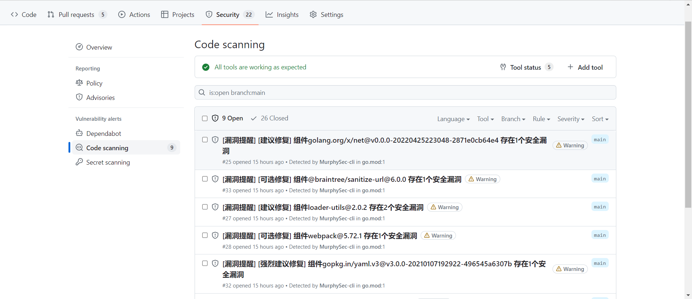

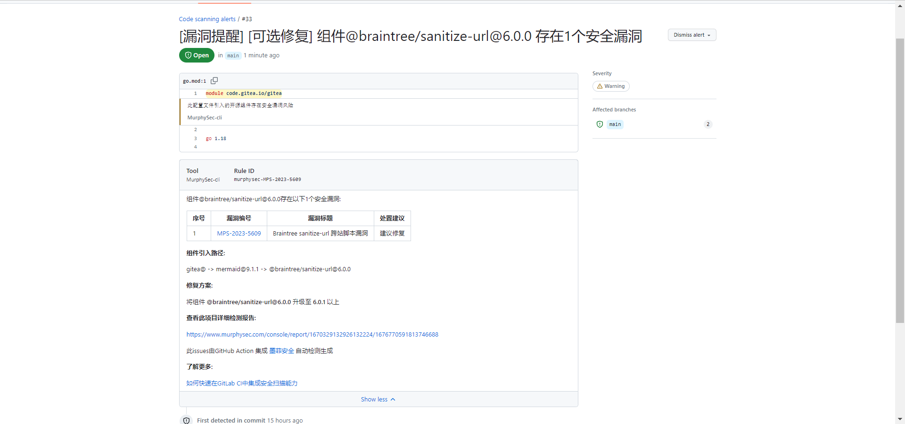

### 1.未开启请点击Actions启用GitHub Actions


如展示如下图所示表示项目已开启Actions


### 2.进入项目页面配置Action权限

点击settings-->Actions-->General-->

勾选Read and write permissions

最下方勾选Allow GitHub Actions to create and approve pull requests

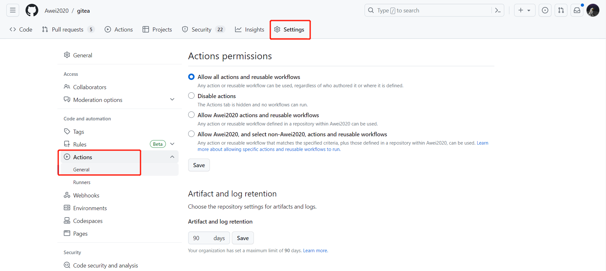


### 3.登录murphysec官网获取token

设置-->访问令牌-->点击复制按钮


### 4.添加MURPHYSEC_TOKEN

点击仓库settings-->Secrets and variables-->Actons-->New repository secret


创建变量name:MURPHYSEC_TOKEN secrets:murphysec官网复制的TOKEN

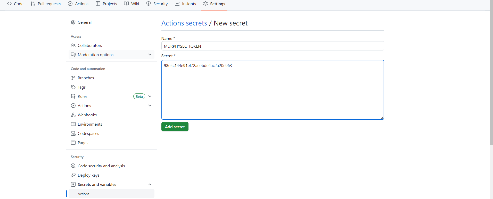

### 5.创建GitHub Actions

点击项目Actions-->New workflows


点击set up a workflow yourself


添加ci代码并提交

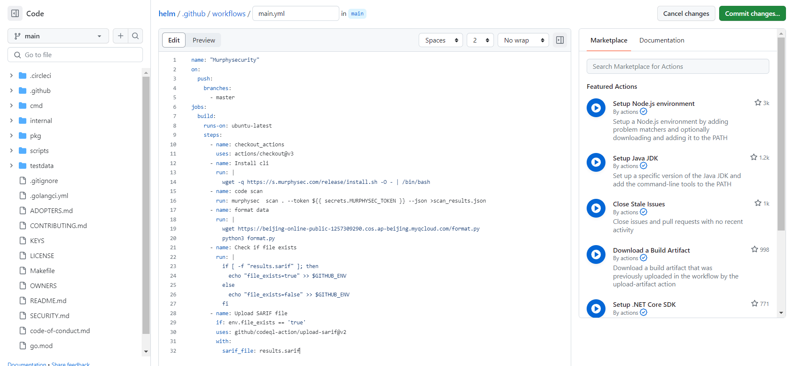

GitHub Actions代码

branches:对应的分支，需要自行修改需要执行检测的分支名称

```YAML
name: "MurphySec code scan"
on:
  push:
    branches:
      - master
jobs:
  build:
    runs-on: ubuntu-latest
    steps:
      - name: Checkout_Actions
        uses: actions/checkout@v3
      - name: Install MurphySec code scan cli
        run: |
          wget -q https://s.murphysec.com/release/install.sh -O - | /bin/bash
      - name: Code scan
        run: murphysec  scan . --token ${{ secrets.MURPHYSEC_TOKEN }} --json >scan_results.json
      - name: Format data
        run: | 
          wget https://s.murphysec.com/github_actions_format.py
          python3 github_actions_format.py
      - name: Check if file exists
        run: |
          if [ -f "results.sarif" ]; then
            echo "file_exists=true" >> $GITHUB_ENV
          else
            echo "file_exists=false" >> $GITHUB_ENV
          fi
      - name: Upload SARIF file
        if: env.file_exists == 'true'
        uses: github/codeql-action/upload-sarif@v2
        with:
          sarif_file: results.sarif
```

### 查看代码检测结果

进入项目页面-->Security-->Code scanning

当前页面展示了所有风险组件的漏洞概览

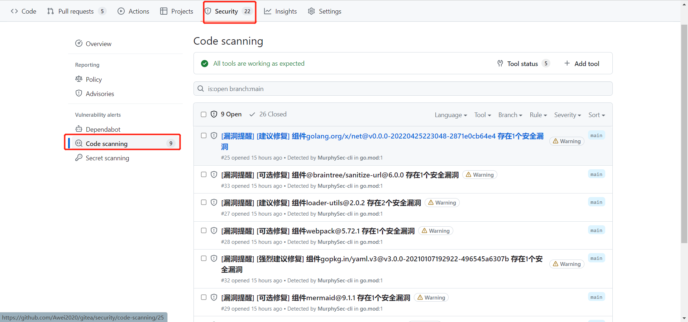

点击要查看的漏洞标题可以进入详细信息页面，之后点击Show more查看详细信息

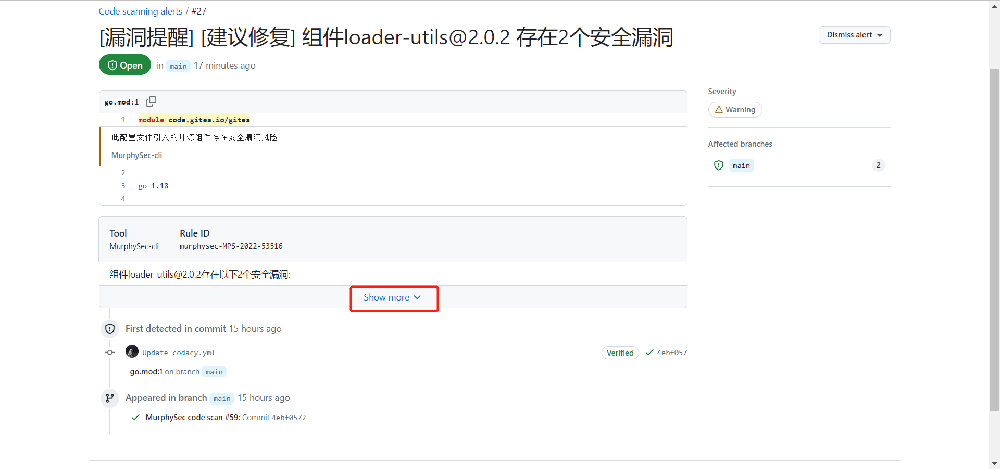

详细信息包含了漏洞的编号，处置建议，引入路径以及修复方案

点击项目检测报告下方链接可以跳转到murphysec官网查看更详细的漏洞信息

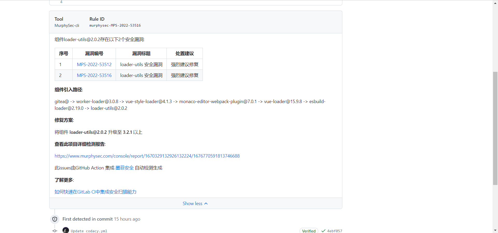

## Gitlab-CI

### 效果图

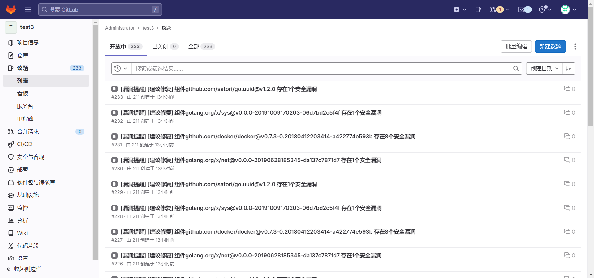

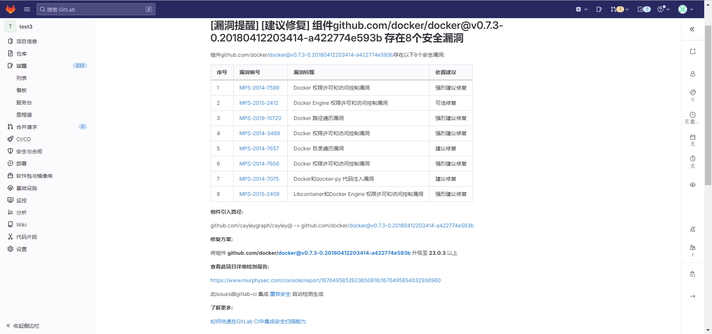

### 1.部署gitlab-runner

```Shell
curl -L https://packages.gitlab.com/install/repositories/runner/gitlab-runner/script.rpm.sh | sudo bash
yum install gitlab-runner
gitlab-runner start
```

### 2.查看gitlab-runner令牌

点击管理员选项卡-->点击CI/CD-->Runer-->复制注册令牌


### 3.注册gitlab-runner

```Shell
gitlab-runner register \
--non-interactive \
--url "gitlab服务地址" \
--registration-token "gitlab-token" \
--executor "shell" \
--description "描述" \
--tag-list "tag标签" \
--run-untagged \--locked="false"
```

### 4.安装murphysec-cli

```Shell
wget -q https://s.murphysec.com/release/install.sh -O - | /bin/bash
```

### 5.安装python以及依赖

- 示例为centos安装python3.6

```Shell
yum install -y python3 wget
pip3 install requests argparse python-gitlab
```

### 6.创建gitlab-ci变量

进入项目仓库-->设置-->CI/CD-->变量

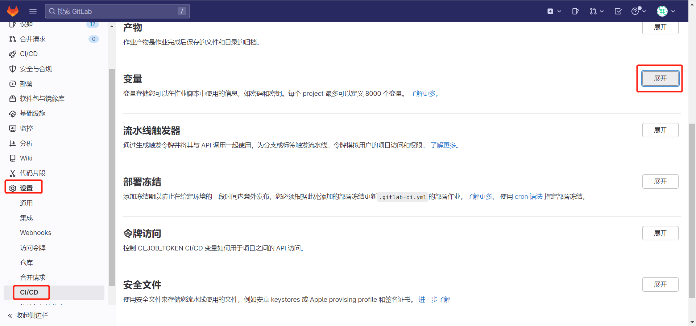

#### 创建gitlab变量


#### 创建变量

- MURPHYSEC_TOKEN:murphysec官网复制的TOKEN

#### 登录murphysec官网获取token

设置-->访问令牌-->点击复制按钮


- GITLAB_URL:gitlab地址(不指定不会提交issue)
- GITLAB_TOKEN:gitlab当前项目令牌(指定GITLAB_URL时配置)

项目页面点击-->设置-->访问令牌

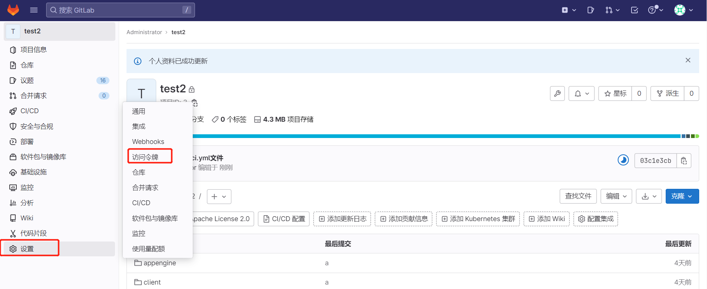

授予api权限

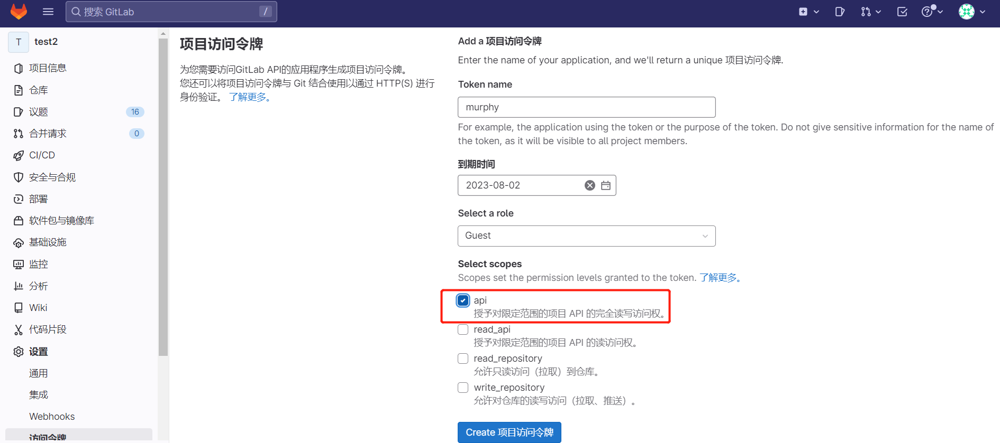

- PROJECT_ID:ci项目的项目id(指定GITLAB_URL时配置)

项目页面点击设置-->通用

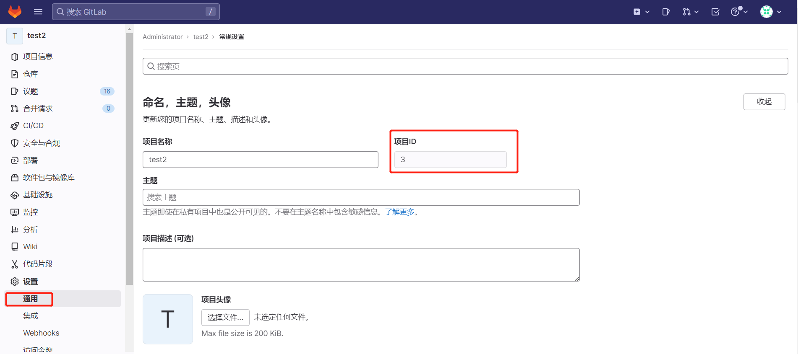

### 7.创建.gitlab-ci文件

仓库点击加号-->新建文件

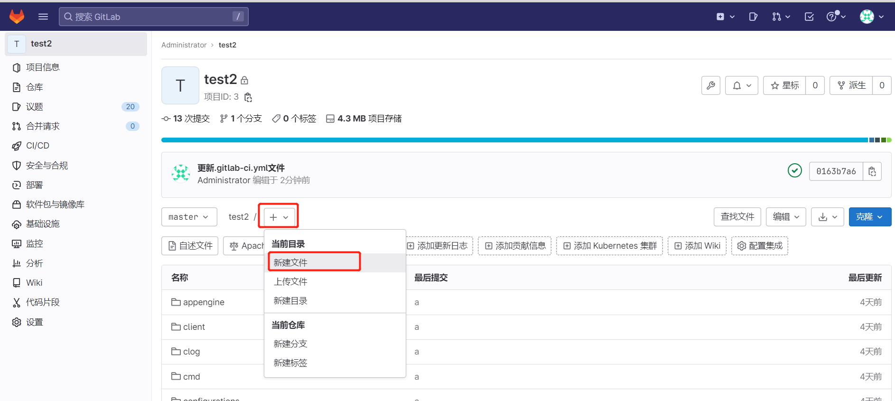

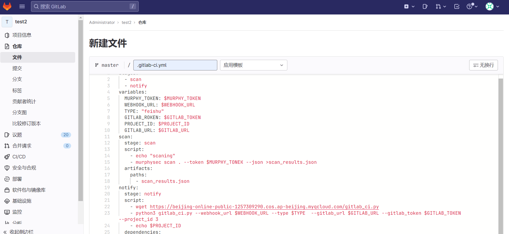

```Shell
stages:
  - Code Scan
  - Issue
variables:
  MURPHY_TOKEN: $MURPHYSEC_TOKEN
  GITLAB_ROKEN: $GITLAB_TOKEN
  PROJECT_ID: $PROJECT_ID
  GITLAB_URL: $GITLAB_URL
scan:
  stage: Code Scan
  script:
    - murphysec scan . --token $MURPHYSEC_TOKEN --json >scan_results.json
  artifacts:
    paths:
      - scan_results.json
issue:
  stage: Issue
  script:
    - wget https://s.murphysec.com/gitlab_ci.py
    - python3 gitlab_ci.py   --gitlab_url $GITLAB_URL --gitlab_token $GITLAB_TOKEN  --project_id $PROJECT_ID
  dependencies:
    - scan
```

### 8.查看代码检测结果

进入项目页面点击议题，页面展示了所有风险组件的漏洞概览

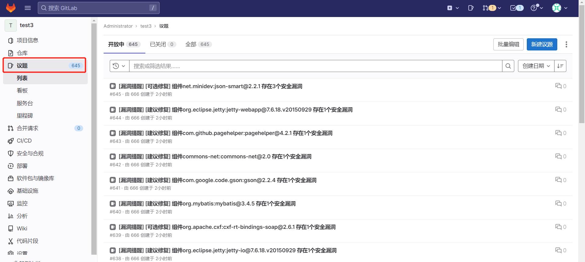

点击要查看的漏洞标题可以进入详细信息页面

详细信息包含了漏洞的编号，处置建议，引入路径以及修复方案

点击项目检测报告下方链接可以跳转到murphysec官网查看更详细的漏洞信息

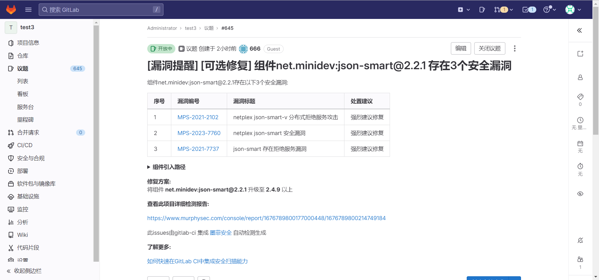
